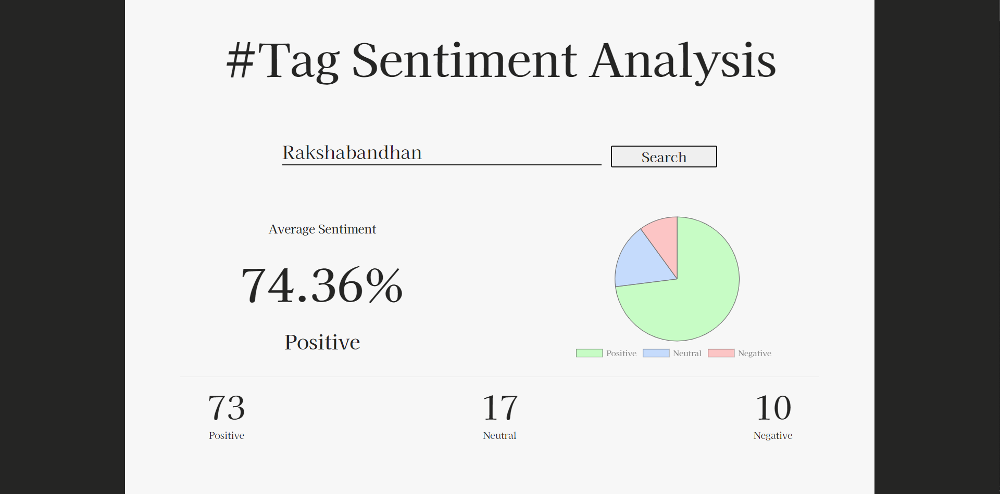

# HashTag Sentiment Analysis
## Introduction
This project was my first try with Natural Language Processing and scraping tweets from Twitter. The model basically takes in a keyword or hashtag and returns the average sentiment around the given keyword / hashtag.

The dataset used was the [Kaggle Sentiment140 Dataset ](https://www.kaggle.com/kazanova/sentiment140) which consists of 1.6 million tweets. The model was developed and trained on Google Colab using thier GPUs. The Frontend and Backend of the web app were added subsequently.

---

## The Dataset and Preprocessing
The dataset used was [Kaggle Sentiment140 Dataset ](https://www.kaggle.com/kazanova/sentiment140) as stated above. The dataset consists of 1.6 millions tweets containing 6 columns out of which I only used 2 :-
* The Body of the tweet 
* The target labels 
    * 4 : Positive 
    * 0 : Negative

I changed the labels to be 1 for Positive and kept Negatives the same.
### Preprocessing
I started by removing all urls, tags, hashtags and stemming (I planned to use custom word embeddings). Words with very low occurences were deleted to avoid crazy memory requirements. After applying the required transformations on the Train, Test and Validation split they were padded with the max length from processing te training set.

## The Deep Learning Model
After a lot of trial and error and time wasted the most optimal configuration I could settle on was used. The embedding size was 5 and only one LSTM layer was used with 64 units. Droupout Regularization with 40% dropout was used. The rest of the model was a straight forward Dense layer.

The details are in the notebook but the model was trained for 200 epochs which didn't show much overfitting and it seemed to get saturated at 80% accuracy. It did just as well on the test set as it did on the validation. The model was then saved along with the preprocessing and model parameters.

## Predictions
For the live predictions tweepy was used to scrape tweets from twitter based on some string. You will have to make a twitter account and register for a developer account to get the required access. **To run the project you will have to replace the dummy access tokens with your own.**

## Backend and Frontend
I decided to make the backend using nodejs and express to make everything easier, a decision which I came to regret later. It has two endpoints one for serving the HTML page and other where the python file is exercuted and the result returned. The python file does all the fetching of tweets, preprocessing and predicting.

The Frontend had the basic trio of HTML, CSS and JS with Chart.js to print a chart.

## Deployment
I decided against deploying it on AWS as multiple tweepy calls would lead me to getting charged. Heroku didn't really like the idea of having to install Python AND Node dependencies and hence refused to work. So I ended up not deploying it.
